# Architecture

## System overview

TinyGB is one emulator core behind three front ends. The core and the helpers around it are plain C with no OS in them; each front end supplies the four things a Game Boy needs from the outside world (a screen, a sound sink, buttons, a place to keep saves) for one platform.

| Target | OS | What it is for | State (2026-09-16) |
|---|---|---|---|
| `host` | Linux or WSL on a desktop | unit tests, the Blargg/acid2 gate, headless captures | done, all green |
| `n31` | N31 Linux on the iPod nano 7G | the playable device build the N31 launcher ships | done, playable |
| `retailos` | Apple's stock firmware, via NanoApps | the playable device build on an unmodified iPod | stub only; this repo's main job |

Both device targets are the same hardware: a 240 x 432 panel, a Cortex-A5 with VFPv4 and no NEON, a CS42L81 codec, two volume buttons, Play/Pause, Home, Power, a three-axis accelerometer, and a multitouch panel (which does not yet work under N31).

```mermaid
flowchart TD
    subgraph portable["Portable (no OS): core/ and platform/"]
        CORE["core/tg_core.h<br/>registry, probe, one core table"]
        PEANUT["core/tg_peanut.c<br/>Peanut-GB + minigb_apu adapter,<br/>save-state serialiser"]
        SCALE["platform/tg_scale.c<br/>160x144 shades -> 240x216 XRGB"]
        CLOCK["platform/tg_audio_clock.c<br/>exact frames-per-video-frame"]
        TILT["platform/tg_tilt.c<br/>accelerometer -> d-pad"]
        PAL["platform/tg_palette.c"]
        PAD["platform/tg_pad.c<br/>on-screen pad: geometry, hit test, draw"]
        TEXT["platform/tg_text.c (new)<br/>6x8 font blitter"]
        CORE --> PEANUT
    end

    subgraph n31["n31/ (Linux)"]
        LMAIN["tg_linux.c<br/>play loop, pause menu, states"]
        LFB["tg_fb_linux.c<br/>DRM atomic or /dev/fb0"]
        LAUD["tg_audio_alsalib.c<br/>blocking write = master clock"]
        LIN["tg_input_linux.c<br/>evdev keys, accel, MT touch"]
        LFS["tg_save.c / tg_roms.c<br/>POSIX stdio, dirent"]
        LMENU["ui/tg_menu.c<br/>LVGL on fbdev"]
        SHIM["n31/shim/<br/>drmfb, fbcon, touch, build_stamp<br/>(vendored from NanoApps)"]
    end

    subgraph ros["RetailOS (NanoApps raw surface): tinygb.c at the root + platform/*_hb.c"]
        RMAIN["tinygb.c<br/>hb_raw_init / hb_raw_frame"]
        RAUD["tg_audio_hb.c<br/>chained SFX descriptors @ 22050"]
        RIN["tg_input_hb.c<br/>hb_touch multi, hb_button, hb_accel"]
        RFS["tg_fs_hb.c<br/>tg_save + tg_roms over hb_fs"]
        RMENU["ui/tg_menu_raw.c<br/>hand-drawn, touch + buttons"]
        RSYS["tg_sys_hb.c<br/>wake lock poke, libc stubs"]
    end

    LMAIN --> CORE & SCALE & CLOCK & TILT & PAL & PAD & LFB & LAUD & LIN & LFS & LMENU
    LFB --> SHIM
    LIN --> SHIM
    RMAIN --> CORE & SCALE & CLOCK & TILT & PAL & PAD & TEXT & RAUD & RIN & RFS & RMENU & RSYS
    RMENU --> TEXT & PAD

    HOST["host/tg_headless.c, host/tests.c"] --> CORE & SCALE & CLOCK & TILT
```

## Why it is shaped this way

- **The core allocates nothing, opens nothing, and keeps no time.** RetailOS has no libc and no malloc; N31 has a 55 MB machine with 15 MB free; the host has everything. Putting any of those assumptions in the core would have meant three cores. See `SPEC-core.md`.
- **The core registry is a table, not an `#ifdef`.** Peanut-GB has no Game Boy Color code at all, so colour is necessarily a second core (SameBoy is the candidate). The seam exists now so three front ends are not rewritten later.
- **Pixels are shade indices until the last moment.** The scaler turns them into 32-bit pixels in the front end's buffer, which is what lets the palette be a setting, the scaler skip unchanged rows, and the host check the device's picture byte for byte.
- **The scaler writes into the destination in place and remembers the last frame.** Both device targets are single-buffered and the buffer persists between frames, so unchanged rows can be skipped. This is a measured saving (writing 207 KB of uncached framebuffer costs 3.85 ms of a 16.74 ms frame on N31) and it is why neither front end double-buffers.
- **Audio clocking is exact rational arithmetic.** 48000 / 59.7275 is 803.65 frames per video frame; handing out 803 starves the sink by 39 frames a second and underruns every four seconds. `tg_audio_clock` accumulates the remainder. The same code gives 369/370 at 22050.
- **The two device targets use opposite clock masters, on purpose.** On N31 the ALSA write blocks, so the codec crystal paces the emulator and video follows. On RetailOS nothing blocks: the OS calls `hb_raw_frame` from a re-armed 16 ms timer and audio is a chain of buffers the mixer drains at its own rate. There the audio queue depth decides how many emulated frames to run per tick (0, 1, or 2), so pitch stays exact and the odd repeated or dropped video frame is invisible. See `SPEC-retailos-frontend.md` and `SPEC-retailos-audio.md`.

## Data flow, per emulated frame

1. Front end reads inputs into one `held` byte (buttons OR tilt OR touch pad hits).
2. `core->set_buttons(ctx, held)`; `core->run_frame(ctx)`.
3. `tg_scale_15(scaler, dst, stride, core->pixels(ctx))` writes 240 x 216 pixels into the front end's surface, skipping unchanged row pairs.
4. `n = tg_audio_clock_next(&clock)`; `core->audio_pull(ctx, buf, n)`; short fills padded with silence; buffer handed to the sink.
5. Every few seconds: checksum SRAM and write it if changed.

## Control flow

- **N31**: `main` -> LVGL picker -> `play_once` loop (blocking on the ALSA write) -> Home -> pause menu -> back or quit. Exit is the process ending; the launcher sends SIGTERM.
- **RetailOS**: the resident calls `hb_raw_init` once, then `hb_raw_frame` per tick forever. There is no exit callback; Home ends the app. So every piece of state that must survive is written on change with a short debounce, and the menu is a mode inside `hb_raw_frame`, not a separate loop.

## State ownership

| State | Owner | Lives in |
|---|---|---|
| Machine state (CPU, PPU, WRAM, VRAM, APU) | core | caller's `ctx` buffer (about 43.5 KiB) |
| ROM bytes | front end | N31: malloc; RetailOS: a static 1 MiB `.bss` window (see `SPEC-retailos-frontend.md`, memory) |
| Battery RAM | front end | heap or `.bss`, mirrored to `<rom>.sav` |
| Previous frame (for row skipping) | `tg_scaler` | 23 KiB inside the scaler |
| Settings (palette, scaling, tilt) | front end | `tg_menu_state`, persisted as a small text file |
| Audio queue | platform sink | N31: ALSA's 341 ms ring; RetailOS: our own slots in OS heap, see the audio spec |

## Persistence model

Everything a player cares about sits beside the cartridge, in the format every other emulator uses: `<rom>.sav` for battery RAM, `<rom>.st0` for the save state. Settings are one key=value text file per platform. See `SPEC-persistence.md`.

## External dependencies

- `vendor/peanut_gb.h` (MIT, Mahyar Koshkouei, late-2023 line) and `vendor/minigb_apu.c` (MIT). Unmodified; adaptations live in `core/tg_peanut.c` and the build flags.
- Test ROMs (Blargg, dmg-acid2) are fetched by `tools/fetch-testroms.sh`, never committed.
- N31: the musl cross toolchain, static alsa-lib and libdrm from `C:\src\ipod\artifacts\linux-n31`, and LVGL (pinned checkout, compiled from a native mirror).
- RetailOS: a NanoApps tree for `sdk/hb_app.mk`, `tools/mkrelocapp.py`, and `start`. Located by `NANOAPPS`, default `../..`, which is right when NanoApps carries this repository as `apps/tinygb` (a git subtree). See `RETAILOS-INTEGRATION.md`.

## Failure modes worth designing for

- **Silent truncation on RetailOS**: a `.hbapp` over 576 KB is read into a fixed slot and truncated without an error; the app then hangs or reboots the device. The build prints the size and fails over a hard limit.
- **Launch-time panic on RetailOS**: the app arena (code + data + `.bss`) is allocated with an allocator that reboots the device on failure. Big static buffers are free in the file but cost here. The ROM window size is the trade-off; the plan measures free heap on the device before fixing it.
- **Audio starvation**: on RetailOS the mixer will happily play out and stop; the sink watches its own queue and restarts with a fade rather than clicking.
- **Lost saves**: no exit callback on RetailOS, SIGKILL after 4 s on N31. Saves are written on change with a debounce, and flushed when the menu opens.

## Observability

- N31: stderr, a once-per-second fps line, and a per-frame ms breakdown (core, blit, apu, sink) on exit; `tools/grab-screen.sh` captures the panel over ssh.
- RetailOS: `hb_trace_log` breadcrumbs into the DRAM ring (`./start trace` from NanoApps), an on-screen build stamp on the About row of the menu, and an optional fps/queue-depth overlay drawn with `tg_text`.
- Host: `tg_headless` prints frame counts and CRCs; the gate prints PASS/FAIL per ROM.

## Deployment shape

- N31: one static ELF copied to `artifacts/linux-n31/tinygb`, installed to the disk volume beside `roms/` by `install-n31os-disk.ps1`, packaged by `mk-release-zip.sh`. See `N31-INTEGRATION.md`.
- RetailOS: one `.hbapp` produced by the root `Makefile`. NanoApps carries this repository as `apps/tinygb` (git subtree), so `./start install tinygb` works unchanged for anyone who clones NanoApps. See `RETAILOS-INTEGRATION.md`.
